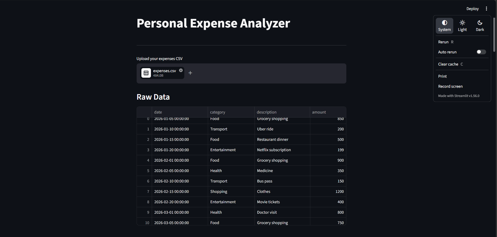
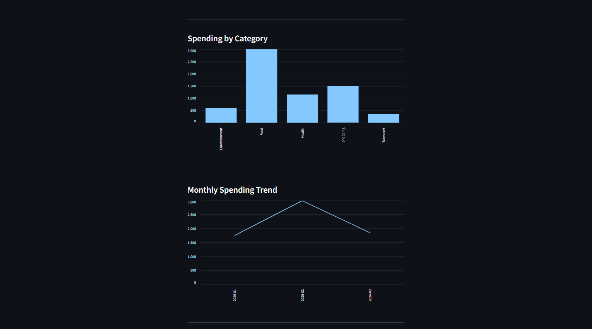
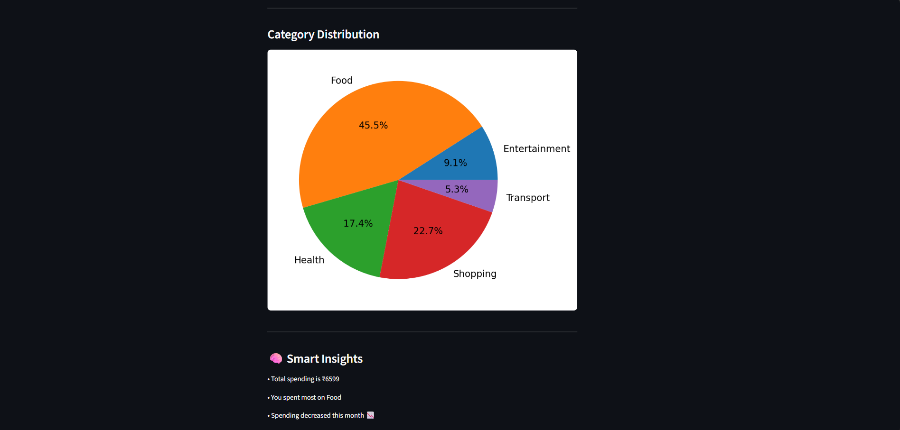

# Personal Expense Analyzer
A Python project to analyze and visualize personal expenses.

## Features
- Upload CSV expense data
- Analyze spending by category and month
- Interactive filters (category & month)
- Visualizations (bar, line, pie charts)
- Smart insights (auto-generated spending summary)

## App Preview

### 🔹 Overview


### 🔹 Charts


### 🔹 Insights


## Tech Stack
- Python
- Pandas
- Matplotlib
- Streamlit

## How to Run

```bash
pip install -r requirements.txt
streamlit run app.py
